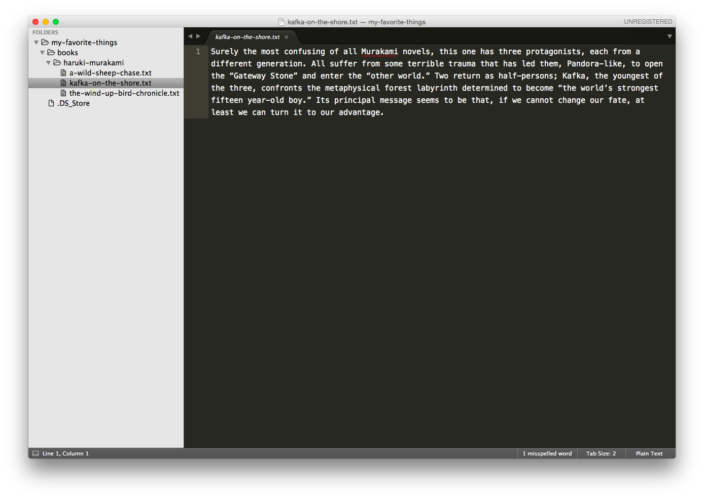
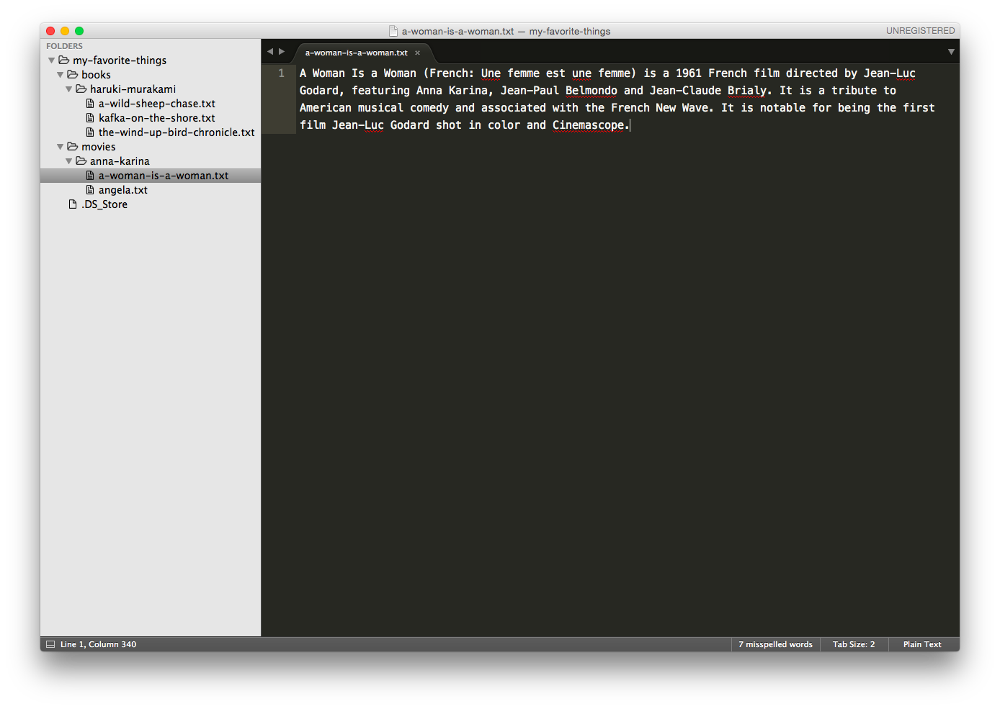
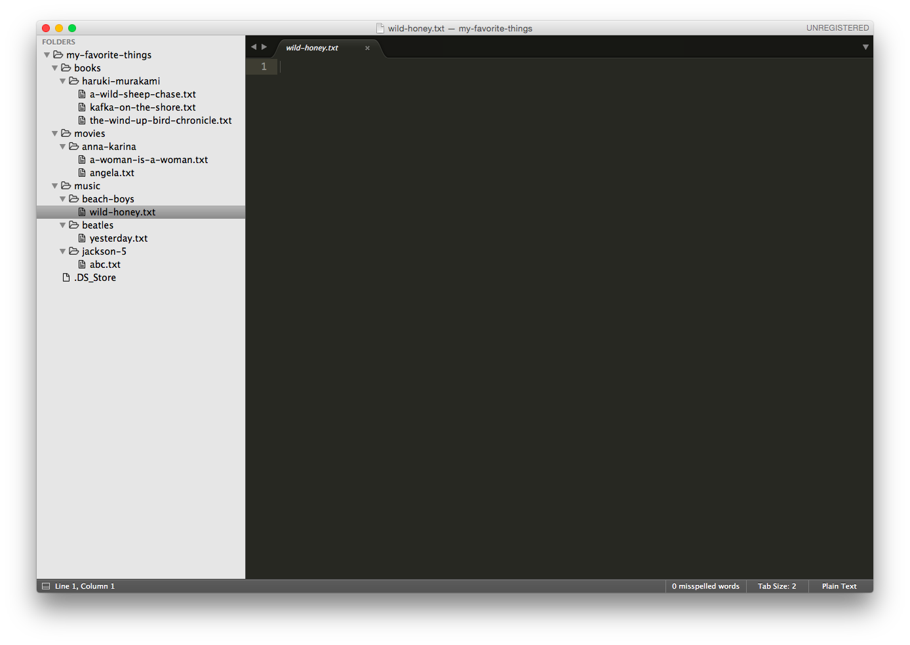
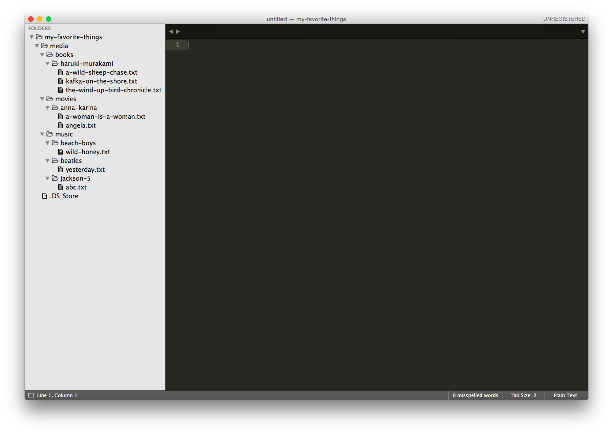

#  Command Line Practice

> ***Note:*** Developing any type of application requires a degree of comfort navigating and interacting with your operating system through the command line. We'll practice creating, modifying, and moving files and folders in your terminal to get you familiar with Unix commands.

> For your first homework assignment, you're going to create files and folders to organize your favorite books, movies, and music — then, you're going to reorganize them.

> Be sure to use the cheatsheets in the "Resources" section if you get stuck.

## Exercise

#### Requirements
- Commands you will need to use for this exercise:
  - Navigate from folder to folder using `cd`.
  - List files using `ls`.
  - Create new directories using `mkdir`.
  - Create new files using `touch`.
  - Move files using `mv`.
  - Copy files using `cp`.
  - Remove directories using `rmdir`.
  - Remove files/directories that contain items using `rm -rf`.
- Text should be added to files using Sublime or Atom.
- Progress should be tracked by comparing your file/folder structure in your code editor to the images supplied under "Deliverable."
- Submit 2-5 questions you would like addressed regarding this homework.

#### Instructions

- From your root directory, create a folder called `my-favorite-things`; you'll use that folder to complete the exercises below.

- Organize your favorite books.

  - In the `my-favorite-things` folder, create a folder named `books`, and navigate to that folder.
  - In the `books` folder, create a folder named after your favorite author (e.g., `mark-twain` or `haruki-murakami`. Use dashes between words instead of spaces!).
  - In the author's folder, create files named after some of his or her books (e.g., `the-wind-up-bird-chronicle.txt`).
  - Navigate back to the `my-favorite-things` folder and list the contents in terminal (using `ls`).
  - Open the `my-favorite-things` folder in Atom or Sublime (Pro tip: You can use the `subl .` command in the terminal to open the current directory in Sublime).
  - In Sublime, edit each file to include a brief description of the book.

- Organize your favorite movies.

  - In the `my-favorite-things` folder, create a folder named `movies`, and navigate to that folder.
  - In the `movies` folder, create a folder named after your favorite actor.
  - Create a folder in the `actor` folder named after his or her breakthrough movie (e.g., `a-woman-is-a-woman.txt`).
  - Look back at Sublime or Atom and edit that text file with a description of the movie.
  - Navigate back to the `movies` directory. Create a text file named after the actor's character.
  - Move the text file to the breakthrough movie folder.

- Organize your favorite music.

  - In the `my-favorite-things` folder, create a folder named `music`.
  - Navigate to the `music` folder.
  - Create a folder named `disco`.
  - Create a text file in `disco` named `ymca`.
  - Delete the `disco` folder.
  - Create folders named `beatles`, `beach-boys`, and `jackson-5` (Pro tip: Look up how to create three folders at once).
  - Create a text file in `beatles` named `yesterday.txt`.
  - Make two copies of `yesterday.txt`. Move one into `beach-boys` and one into `jackson-5`, and rename those files as songs by those artists.

- Reorganize _everything_.

  - In the `my-favorite-things` folder, create a folder named `media`.
  - Move `books`, `movies`, and `music` into the `media` folder.

#### Bonus

- Look through the additional resources and:

  - Look at the top/bottom 10 lines of each file.
  - Figure out how to search through a file for a string of text from the command line — without opening the file.
  - See if you can figure out how to open a file and add text content in the command line instead of using Sublime or Atom.

#### Starter Code

No starter code required! Just open up your terminal application to get started.

#### Deliverable

Be sure you open up your `my-favorite-things` directory in Sublime or Atom so you can track your progress. Here's how your files/folders should appear after each big step in the exercise:

- After "Organize your favorite books":

- After "Organize your favorite movies":

- After "Organize your favorite music":

- After "Reorganize _everything_":

## Resources
- A list of [CLI Shortcuts](https://gist.github.com/alexpchin/01caa027b825d5f98871)
- An awesome Unix command [cheatsheet](https://github.com/veltman/clmystery/blob/master/cheatsheet.md)

## Additional Practice
- [CLI Gardening](https://github.com/ga-dc/cli_gardening)

## Hungry For More?
- Try to complete the [Kitchen Organizer](labs/kitchen/README.md) lab in as few steps as possible. Look up shortcuts along the way!
- Practice using other popular commands we didn't cover in class by completing the [Command Line Fu — Challenge](https://github.com/ga-wdi-exercises/command_line_fu) lab.
- Brownie points for configuring your terminal using [iTerm](https://www.iterm2.com/). Find some helpful instructions [here](http://yoderbacon.com/blog/2014/10/22/how-to-customize-iterm/).
- Practice using these [CLI Shortcuts](https://gist.github.com/alexpchin/01caa027b825d5f98871).
